# 一、历史背景


很少有研究领域可以追溯到它们诞生在历史上的那个时刻和地点，但是网络科学背后的数学支架——图论可以。它的起源可以追溯到1735年，在东普鲁士的首都科尼士堡，这是当时一个繁荣的商业城市。在繁忙的船队的支持下，市政官员得以在围绕小镇的普雷格尔河上修建了七座桥。其中五个与大陆相连的是优雅的克奈福夫岛，夹在普雷格尔河的两个分支之间。剩下的两个部分都穿过了河流的两个支流（如下图所示）。
这种特殊的安排产生了一个当代的谜题：一个人能穿过所有七座桥而不会穿过同一座桥吗？即七桥问题。尽管尝试了很多次，但还是没有人能找到这样的路。这个问题一直没有解决，直到1735年，瑞士出生的数学家伦纳德·欧拉提供了一个严格的数学证明，证明这种路径不存在。

欧拉用字母A、B、C和D表示被河流分隔的四个土地区域（图c）。接下来，他把每一块之间有一座桥的土地连接起来。因此，他建立了一个图表，其中的节点是土地的碎片，连接部分是桥梁。然后欧拉做了一个简单的观察：如果有一条路径穿过所有的桥，但永远不是同一座桥两次，那么具有奇数链接的节点必须是这条路径的起点或终点。实际上，如果你到达一个带有奇数链接的节点，你可能会发现自己没有未使用的链接可以离开它。
一条穿过所有桥梁的步行道只有一个起点和一个终点。因此，这样的路径不能存在于具有两个以上的奇数链接节点的图上。柯尼斯伯格图有四个具有奇数链接的节点a、B、C和D，所以没有一条路径不能满足这个问题。
欧拉的证明是第一次有人用图来解决数学问题。对我们来说，证明有两个重要的信息：第一个是，如果一些问题作为图，就会变得更简单、更易于处理。第二，路径的存在，柯尼斯堡的桥梁不依靠我们的独创性来找到它。相反，它是图的一个属性。事实上，考虑到柯尼斯伯格图的结构，无论我们多么聪明，我们都永远无法找到我们想要的路径。换句话说，网络在其结构中具有编码的属性，这限制或增强了它们的行为。


# 二、基本名词


## （1）图论

图论〔Graph Theory〕是应用数学的一个分支。它以图为研究对象。图论中的图是由若干给定的点及连接两点的线所构成的图形，这种图形通常用来描述某些事物之间的某种特定关系，用点代表事物，用连接两点的线表示相应两个事物间具有这种关系。图论是一种表示 "多对多" 的关系。

## （2）图是由顶点和边组成的：(可以无边，但至少包含一个顶点)
一组顶点：通常用 V(vertex) 表示顶点集合
一组边：通常用 E(edge) 表示边的集合

## （3）图可以分为有向图和无向图，在图中：                                  	    
(v, w) 表示无向边，即 v 和 w 是互通的                             	    <v, w> 表示有向边，该边始于 v，终于 w

## （4）图可以分为有权图和无权图：                                             	
有权图：每条边具有一定的权重(weight)，通常是一个数字               	 无权图：每条边均没有权重，也可以理解为权为 1

## （5）图又可以分为连通图和非连通图：                                  
连通图：所有的点都有路径相连                                    非连通图：存在某两个点没有路径相连

## （6）图中的顶点有度的概念：
 度(Degree)：所有与它连接点的个数之和                                                              
 入度(Indegree)：存在于有向图中，所有接入该点的边数之和                                         
 出度(Outdegree)：存在于有向图中，所有接出该点的边数之和


# 三、图的表示：


## 1. 邻接矩阵：

在 n 个顶点的图需要有一个 n × n 大小的矩阵                                 在一个无权图中，矩阵坐标中每个位置值为 1 代表两个点是相连的，0 表示两点是不相连的，在一个有权图中，矩阵坐标中每个位置值代表该两点之间的权重，0 表示该两点不相连，在无向图中，邻接矩阵关于对角线相等

## 2. 邻接链表：
对于每个点，存储着一个链表，用来指向所有与该点直接相连的点，对于有权图来说，链表中元素值对应着权重


# 四、算法


图论中有多种算法，这里介绍两种：

## （1）最短路径算法
定义：从某顶点出发，沿图的边到达另一顶点所经过的路径中，各边上权值之和最小的一条路径叫做最短路径。解决最短路的问题有以下算法，Dijkstra算法，Bellman-Ford算法，Floyd算法和SPFA算法等。
无权图：
问题：在图中找到某一个顶点到其它所有点的距离
对于初始点 v 来说，某个点的 d 代表该点到初始点的距离。
基本步骤：
### 1.将所有点的距离 d 设为无穷大
### 2.挑选初始点 s，将 ds 设为 0，将 shortest 设为 0
### 3.找到所有距离为 d 为 shortest 的点，查找他们的邻接链表的下一个顶点 w，如果 dw 的值为无穷大，则将 dw 设为 shortest + 1
### 4.增加 shortest 的值，重复步骤 3，直到没有顶点的距离值为无穷大

## （2）最小生成树
定义：一个有 n 个结点的连通图的生成树是原图的极小连通子图，且包含原图中的所有 n 个结点，并且有保持图连通的最少的边。最小生成树可以用kruskal（克鲁斯卡尔）算法或Prim（普里姆）算法求出。 
例题：按下图做最小生成树
```{r setup}
knitr::opts_chunk$set(echo = TRUE)
library(igraph)
vn<-12
rownames<-letters[1:vn]
colnames<-letters[1:vn]
adjacency_matrix=matrix(0,vn,vn,byrow=T,dimnames=list(rownames,colnames))            
adjacency_matrix_k=matrix(0,vn,vn,byrow=T,dimnames=list(rownames,colnames))          
adjacency_matrix_p=matrix(0,vn,vn,byrow=T,dimnames=list(rownames,colnames))          
link <- function(x,y,w){#构建邻接矩阵与子节点矩阵
  adjacency_matrix[x,y]<<-w
  adjacency_matrix[y,x]<<-w
}
link_k <- function(x,y,w){#构建邻接矩阵与子节点矩阵
  adjacency_matrix_k[x,y]<<-w
  adjacency_matrix_k[y,x]<<-w
}
link_p <- function(x,y,w){#构建邻接矩阵与子节点矩阵
  adjacency_matrix_p[x,y]<<-w
  adjacency_matrix_p[y,x]<<-w
}
a=1;b=2;c=3;d=4;e=5;f=6;g=7;h=8;i=9;j=10;k=11;l=12
link(a,b,2);link(b,c,3);link(c,d,1)
link(a,e,3);link(b,f,1);link(c,g,2);link(d,h,2)
link(e,f,4);link(f,g,3);link(g,h,3)
link(e,i,4);link(f,j,2);link(g,k,4);link(g,l,3)
link(i,j,3);link(j,k,3);link(k,l,1)
print(adjacency_matrix)
myg=graph.adjacency(adjacency_matrix,mode = "undirected",weighted = TRUE) 
myl <-layout.reingold.tilford(myg)
myl[a,]=c(0,2);myl[b,]=c(1,2);myl[c,]=c(2,2);myl[d,]=c(3,2)
myl[e,]=c(0,1);myl[f,]=c(1,1);myl[g,]=c(2,1);myl[h,]=c(3,1)
myl[i,]=c(0,0);myl[j,]=c(1,0);myl[k,]=c(2,0);myl[l,]=c(3,0)
E(myg)$width=E(myg)$weight
plot.igraph(myg,layout = myl,edge.label = E(myg)$weight)


Sys.sleep(1.5)
visited <- c(0*(1:vn))
Prim <- function(){
  for(o in 1:vn-1 ){
    for(i in order(E(myg)$weight)){
      i=as.numeric(i)
      v1<-as.numeric(charToRaw(get.edgelist(myg)[i,1]))-as.numeric(charToRaw('a'))+1
      v2<-as.numeric(charToRaw(get.edgelist(myg)[i,2]))-as.numeric(charToRaw('a'))+1
      if(visited[v1]==1&&visited[v2]==0){
        link_p(v1,v2,E(myg)[i]$weight)
        visited[v2]=1
        E(myg)[i]$color="red"
        plot.igraph(myg,layout=myl,main="Prim",edge.label = E(myg)$weight)
        Sys.sleep(1)
        break
      }
      if(visited[v2]==1&&visited[v1]==0){
        link_p(v1,v2,E(myg)[i]$weight)
        visited[v1]=1
        E(myg)[i]$color="red"
        plot.igraph(myg,layout=myl,main="Prim",edge.label = E(myg)$weight)
        Sys.sleep(1)
        break
      }
    }
  }}
visited[a]=1
Prim()
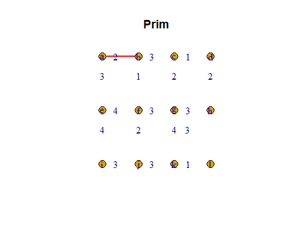
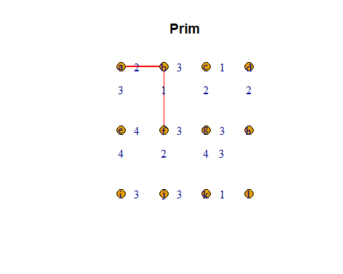
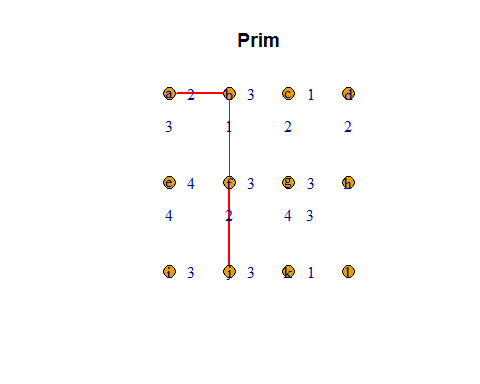
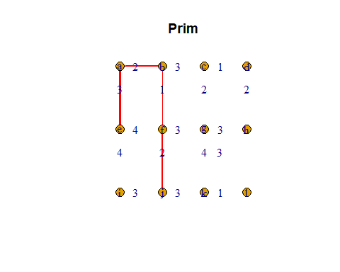
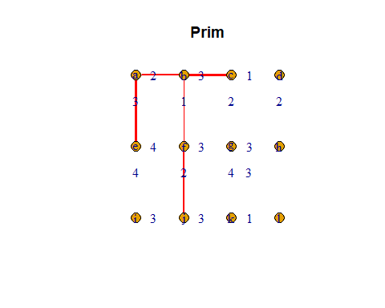
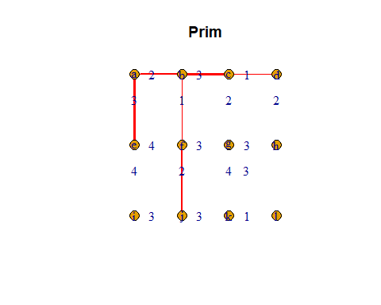
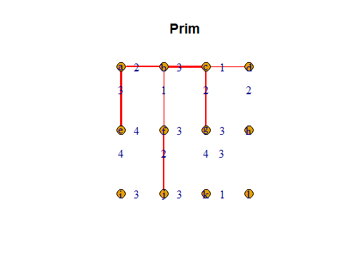
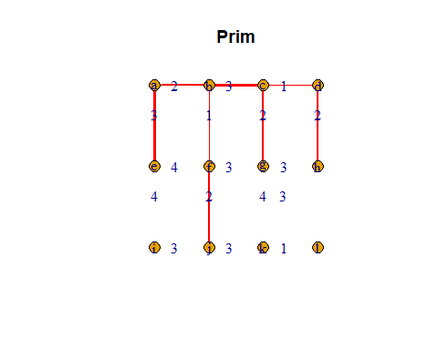
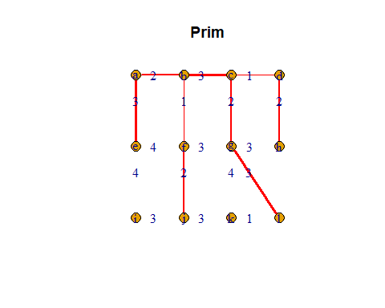
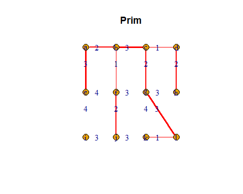
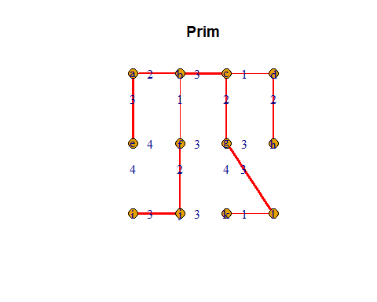
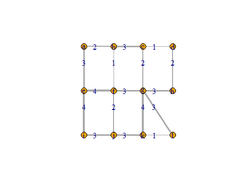


myg_p=graph.adjacency(adjacency_matrix_p,mode = "undirected",weighted = TRUE)
E(myg_p)$width=E(myg_p)$weight
plot.igraph(myg_p,layout=myl,main="Prim",edge.label = E(myg_p)$weight)
print("Adjacency Matrix for Prim:")
print(adjacency_matrix_p)
Sys.sleep(1.5)
plot.igraph(myg,layout = myl,edge.label = E(myg)$weight)
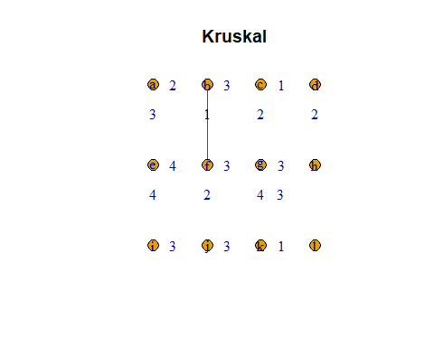

Sys.sleep(1.5)
myset<-c(0*(1:vn))
setcnt<-0
same_set=matrix(0,vn,vn,byrow=T)
bindset <- function(x,y){
  same_set[x,y]<<-1
  same_set[y,x]<<-1
  for(i in 1:vn){
  i=as.numeric(i)
  if(same_set[y,i]==1&&i!=x&&i!=y&&same_set[x,i]==0) bindset(i,x)
  if(same_set[x,i]==1&&i!=y&&i!=x&&same_set[y,i]==0) bindset(i,y)
  }
}
for(i in 1:vn) same_set[i,i]=1
Kruskal <- function(){
  cnt<-0
  for(i in order(E(myg)$weight)){
    i=as.numeric(i)
    v1<-as.numeric(charToRaw(get.edgelist(myg)[i,1]))-as.numeric(charToRaw('a'))+1
    v2<-as.numeric(charToRaw(get.edgelist(myg)[i,2]))-as.numeric(charToRaw('a'))+1
    if(myset[v1]==0&&myset[v2]==0){
      setcnt<<-setcnt+1
      myset[v1]<<-setcnt
      myset[v2]<<-setcnt
      link_k(v1,v2,E(myg)[i]$weight)
      E(myg)[i]$color="red"
      plot.igraph(myg,layout=myl,main="Kruskal",edge.label = E(myg)$weight)
      #Sys.sleep(1)
      cnt=cnt+1
      if(cnt==vn-1) break
    }
    else{ if(myset[v1]==0||myset[v2]==0){
      if(myset[v2]==0) myset[v2]=myset[v1]
      else myset[v1]=myset[v2]
      link_k(v1,v2,E(myg)[i]$weight)
      E(myg)[i]$color="red"
      plot.igraph(myg,layout=myl,main="Kruskal",edge.label = E(myg)$weight)
      Sys.sleep(1)
      cnt=cnt+1
      if(cnt==vn-1) break
    }
    else if(same_set[myset[v1],myset[v2]]==0){
      bindset(myset[v1],myset[v2])
      link_k(v1,v2,E(myg)[i]$weight)
      E(myg)[i]$color="red"
      plot.igraph(myg,layout=myl,main="Kruskal",edge.label = E(myg)$weight)
      Sys.sleep(1)
      cnt=cnt+1
      if(cnt==vn-1) break
    }
    }
  }
}
Kruskal()
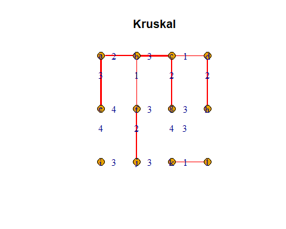
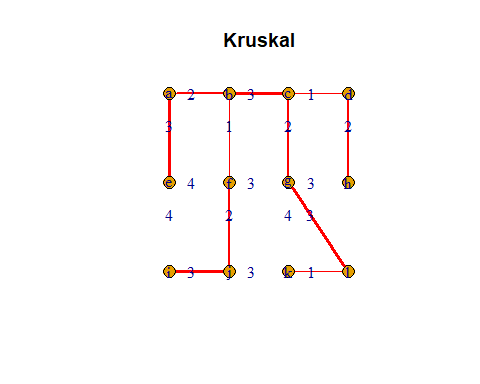
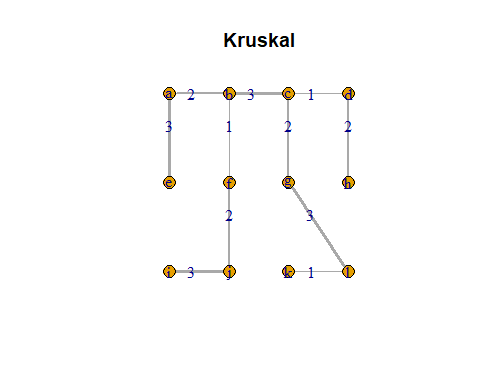

Sys.sleep(1)
myg_k=graph.adjacency(adjacency_matrix_k,mode = "undirected",weighted = TRUE) 
E(myg_k)$width=E(myg_k)$weight
plot.igraph(myg_k,layout=myl,main="Kruskal",edge.label = E(myg_k)$weight)
print("Adjacency Matrix for Kruskal:")
print(adjacency_matrix_k)
Sys.sleep(1.5)
```


# 五、总结


## （1）最短路径算法优缺点：

优点：算法简明、能得到最优解
缺点：效率低（特别是有时候不需要最优解）、运算中占用空间大

## （2）最小生成树算法：

一个图的生成树不是唯一的，不同的搜索方法最后的生成树不同，即使是同一种搜索方法，不同的出发点最后的生成树也不同。

## （3）图论的应用


# 六、参考文献

【1】Albert-Laszlo Barabasi - Network Science 
【2】Networks An introduction
