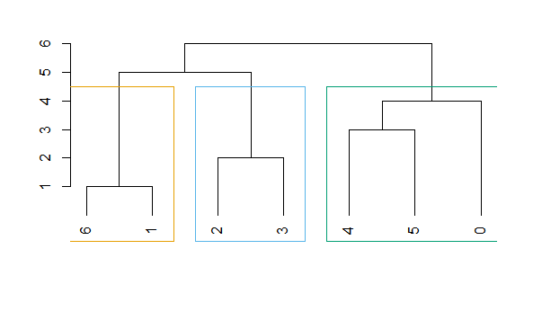

# 一、简介

发现复杂网络中社区结构的过程称为社区发现。社区发现算法通常依据所提供的图，进行社区划分。其中节点表示个体，边表示个体之间共享的内容或属性。

# 二、原理分析

### 1.社区发现算法

复杂网络通常表现出社区的结构特征，每个节点与其最相似的节点往往会被分配给同一社区，同一社区内的节点具有相同的特性，社区内部比社区之间的连接要密集得多。

目前社区发现算法主要有谱二分法、最大流算法、多层次图分割算法等图分割法，层次聚类、划分聚类、谱聚类、局部聚类等聚类算法，谱方法，贪心、模拟退火、极值优化、谱优化等基于模块度的方法，自旋模型、随机游走、同步算法等动态算法，生成模型、判别模型等基于统计推断的方法，重叠社区算法，动态社区发现算法等。

社区发现和图划分有一定共通之处，但是社区发现旨在揭露网络固有的社区结构，社区的数量和大小没有预定义。将网络划分为很多组，这样每个节点属于一个并且只属于一个组。可能的分区的数量如下：

$B_{N}=\frac{1}{e}\sum_{j=0}^{\infty } \frac{j^{N} }{j!}$ 
 
 社区发现算法通常分为：

（1）基于特定成员的社区。

（2）基于特定社区形式的社区。

理论上，任何子图都可以被搜索并假定为一个社区。在实践中，只有具有具有特定特征的节点的子图才被视为社区。

常用的三个一般节点特征是节点相似度、节点熟悉度和节点可实现性。当使用节点度时，我们寻找子图，它们通常是连接的，这样每个节点（或节点的一个子集）都有一定的节点度（传入或传出边的数量）。在节点相似性中，我们假设高度相似的节点属于同一社区。

### 2.边介数

在节点的最短路径中，边介数是通过边E的总和。

$c_{B}\left ( e \right ) = {\textstyle \sum_{s,t\in V}^{}} \frac{\sigma \left ( s,t|e \right ) }{\sigma \left ( s,t \right ) }$

其中V是节点的集合，σ(s,t)σ(s,t)是节点(s，t)之间最短路径的个数。σ(s,t|e)σ(s,t|e)是节点(s，t)之间，通过边e的，最短路径的个数。

# 三、模型分析

GN(Girvan-Newman)算法是使用边界数作为相似度的度量方法，运用聚类中的分裂思想不断地删除边。

除边界数之外，还可以依据节点之间的相似性,例如：Jaccard相似系数(Jaccard similarity coefficient)、余弦相似度(cosinesimilarity)、高度值节点提升指标(hubpromotedindex)以及高度值抑制指标(hub depressed index),通过计算对网络进行社区发现，节点之间相似性越大距离就越小，表示2个节点越近；相似性越小距离就越大，表示2个节点越远。

GN算法的思想：

在一个网络之中，通过社区内部的边的最短路径相对较少，而通过社区之间的边的最短路径的数目则相对较多。在GN算法中，每次都会选择边介数高的边进行删除。

GN算法的步骤如下： 

（1）计算每一条边的边介数； 

（2）删除边界数最大的边； 

（3）重新计算网络中剩下的边的边介数；

（4）重复(3)和(4)步骤，直到网络中的任一顶点作为一个社区为止。

# 四、R语言代码实现

### 1.通过igraph进行网络构建

```{r}
library(igraph)
g <- graph.formula(0-5,5-4,4-3,3-2,2-1,1-6)
V(g)
E(g)
ecount(g)
is.weighted(g)
ebc <- edge.betweenness.community(g)
library(ape)
membership(ebc)
0543216 
1112233 
dendPlot(ebc, mode="hclust")
```



### 2.通过GN算法进行社区发现

GN算法通过从网络中不断移除介数最大的边，使每个节点变成退化的社区。

```{r}
g <- graph.formula(0-5,5-4,4-3,3-2,2-1,1-6)
edge.betweenness(g)
#12最大，去掉4-3这条边
edge.betweenness(graph.formula(0-5,5-4,3-2,2-1,1-6))
#4最大，去掉2-1这条边
edge.betweenness(graph.formula(0-5,5-4,3-2,1-6))
#2最大，去掉0-5这条边
edge.betweenness(graph.formula(5-4,3-2,1-6))
#1最大，去掉5-4这条边
edge.betweenness(graph.formula(3-2,1-6))
#1最大，去掉3-2这条边
edge.betweenness(graph.formula(1-6))
plot(ebc,g) 
 
```


### 3.输出模块度

通过模块度用来量化对复杂网络进行社区发现的水平。

```{r}

print(modularity(ebc))
```

# 五、反思改进

目前对社区发现的研究在节点信息、社区结构优度以及划分准确率方面仍然存在着不足。GN算法在计算边界数时会出现重复计算最短路径情况，导致时间复杂度过高。

# 六、参考文献

[1]Albert-Laszlo Barabasi.Network Science[M].2014

[2]山东大学学报(理学版)2021,56(09),1-12+20

[3]Zafarani R., Abbasi M.A., Liu H. - Social Media Mining.An Introduction-CUP (2014)
