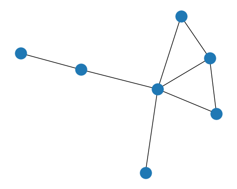
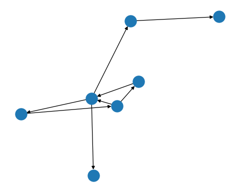

  
# （一）简介
  
我们在使用计算机分析实际网络的性质时，为了表现图中顶点之间的联系，可以使用
一个能反映边与边之间联系的二维数组，这个二维数组构成的矩阵就称为邻接矩阵（Adjacency matrix）。

# （二）邻接矩阵的性质

## 1.邻接矩阵的基本性质

(1)邻接矩阵的行和列分别表示顶点。对于矩阵 matrix[a1][a2],其中a1和a2是两个
表示图顶点的向量，在邻接矩阵中分别占据行和列。矩阵中的每个元素的取值为1或者
0，当两个顶点之间存在边时，则对应的元素值为1，否则为0.（顶点与自己本身的边
默认为0，故对应元素的值也为0）

(2)改变图中的顶点的标号次序，相当于对邻接矩阵做正交相似变换，而根据矩阵论，
正交相似变换并不改变矩阵的包括特征值在内的许多性质。

## 2.无向网络图的邻接矩阵的性质

(1)顶点的度=对应行或列中元素为1的个数

(2)无向图的邻接矩阵是对称的

## 3.有向网络图的邻接矩阵的性质

(1)由于有向网络边具有方向性，故其邻接矩阵不一定对称

(2)顶点的出度=对应行元素之和

(3)顶点的入度=对应列元素之和

(4)顶点的度=对应行和列元素之和

# （三）邻接矩阵的作用及实例的代码实现

## 1.作用

(1)由于邻接矩阵能准确描述顶点与顶点，边与边之间关系，
顶点与边之间的关系，故我们可以通过已知的邻接矩阵进行图
的绘制。

(2)我们可以分析邻接矩阵来研究图的许多性质

## 2.代码（此处用Python绘制有向图和无向图为例）

(1)无向图绘制

```{python}
import matplotlib.pyplot as plt
import networkx as nx
G = nx.Graph()
G.add_node(1)
G.add_node(2)
G.add_nodes_from([3, 4, 5, 6])
nx.add_cycle(G,[1, 2, 3, 4])
G.add_edge(1, 3)
G.add_edges_from([(3, 5), (3, 6), (6, 7)])
nx.draw(G)
plt.show()
```




(2)有向图绘制


```{python}
import matplotlib.pyplot as plt
import networkx as nx
P=nx.DiGraph()
P.add_node(1)
P.add_node(2)
P.add_nodes_from([3, 4, 5, 6])
nx.add_cycle(P,[1, 2, 3, 4])
P.add_edge(1, 3)
P.add_edges_from([(3, 5), (3, 6), (6, 7)])
nx.draw(P)
plt.show()
```



# (四)总结

## 优势

(1)通过邻接矩阵，能够让我们直观的了解边和顶点之间的关系

(2)邻接矩阵利用二维数组表示图，能使图的存储方式更加简单

(3)邻接矩阵的元素的行或列的和，能够表示对应顶点的度，使对
顶点的描述更加简单

## 不足

(1)无向图的邻接矩阵是对称的，只需要存储上三角部分就可以了，但实际上，大规模
的复杂网络往往是稀疏的，这意味着其对应的大部分元素均为0，这些矩阵被称作稀疏
矩阵，在描述稀疏图时会导致很多无效元素的产生，导致存储资源的浪费。

# （五）参考文献

[1]Albert-Laszlo Barabasi.Network Science[M].2014:11-12

[2]M.E.J.newmanNetworks an introduction[M].2010

[3]汪小帆,李翔,陈关荣.网络科学导论[M].北京:高等教育出版社,2012.4:44-46
