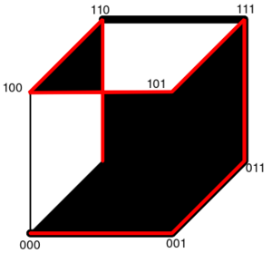
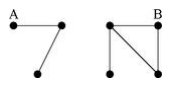
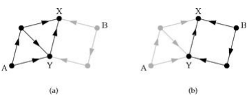
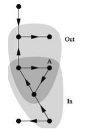

# 一、路径
（1）简介
  Path，是路径的意思。在图论中，图中路径path是一个有限或无限的边序列，这些边连接着一系列顶点，这些顶点在大多数定义中都是不同的(又因为这些顶点是不同的，所以图中的边也是不同的).有向图中的有向路径directedpath（有时也称为dipath），是一个有限或无限的边序列,它连接一系列不同的顶点,并具有附加一个条件:序列中所有的边都方向都相同。
  路径path是一条所有顶点（包括所有边）都是不同的轨迹。如果$w=(e_1,e_2,...,e_{n-1})$是有顶点的序列$(v_1,v_2,...,v_n)$,那么w就是从v1到vn的有限通路.同样,对于一条轨迹或者一条路径也是如此.如果两个不同的顶点之间有一个有限通路,那么在它们之间也有一条有限的轨迹和一条有限的路径.有些学者对路径的定义中并不要求它的所有顶点都是不同的,而是使用术语“简单路径”来指代这样的路径.一个加权图weightedgraph将一个值（权重）与图中的每条边相关联.一个加权图中的通路（或轨迹或路径）的权是所有边的权之和.有时,“成本 cost”或“长度 length”这两个词可以用来指代“权重”这一概念。
（2）定义
  假设一个无向图G=(V,E).一个无向图G=(V,E)中的一条路径是指一个顶点序列P=$v_1,v_2,...,v_k$,其中每一对相邻的顶点$v_1$和$v_{i+1}$之间都有一条边.P称为从$v_1$到$v_i$的一条路径或简称为一条$v_1-v_k$路径.一条路径的长度(length)定义为这条路径所包含的边的数目。路径（通路）：是图的一个点、边的交错序列，$v_0$和$v_n$分别称为路径的起点和终点，n为路径的长度。
简单路径：边各不相同的路径。
初级路径：结点、边都各不相同的路径，又称基本路径。
回路：起点和终点重合的路径，又分简单回路、初级回路（圈）。
注意：单独一个结点,也是路径，它是长度为 0 的基本路径。
（3）性质
定理①：无向图中，若从$v_1$至$v_2$存在路径，则从$v_2$至$v_1$存在路径；有向图中，若从$v_1$至$v_2$存在路径，则$v_2$至$v_1$不一定存在路径。
定理②：n阶图G中，如果存在从$v_1$至$v_2$的路径，则存在从$v_1$至$v_2$的基础路径，其基础路径的长度小于等于n-1。
定理③：图 G是初级回路，当且仅当G的阶与边数相等，且在G中存在这样一条从 V到V的回路，使得除V 在该闭路径中出现两次外，其余结点和每条边都在该回路上恰好出现一次。
（4）R语言实践
R中的路径设置主要有以下几个方面：工作目录的路径、安装包的路径。
1.使用getwd()函数来显示当前工作目录；2.使用setwd()函数更改当前目录；
注意： 
1、函数setwd()不会自动创建一个不存在的目录。如果必要的话，可以使用函数dir.create()来创建新目录，然后使用setwd()将工作目录指向这个新目录。
2、R里的dir.create()是不级联的，就是说一次只能创建有一个“/”的路径。如果需要两个“/”的路径，就需要用dir.create()创建两次，然后文件才创建成功。再按照例子用setwd()去设置即可。
3、函数setwd()是设置临时的工作路径。
（5）例子
1、如果路径包含每一对顶点，那么图就是连通的。
2、如果一个有向图中存在包含每对顶点的相对有向路径，那么这就是强连接有向图 Strongly-connected digraph。
3、没有边连接两个不连续的路径顶点的路径称为诱导路径 induced path。
4、包含图的每个顶点的路径称为哈密顿路径 Hamiltonian Path。如下图所示。

一个三维的超立方体图表显示一个红色的哈密顿图，和一个黑色的最长诱导路径

5、如果两条路径没有任何共同的内部顶点，那么它们与顶点无关（换言之，内部顶点不相交）。类似地，如果两条路径没有任何共同的内边，那么它们是边独立的（或边不相交）。两条内部顶点不相交的路径的边也不相交，但反之未必正确的。
6、图中两个顶点之间，如果最短路径存在，那么它们的的距离是最短路径的长度，否则该距离是无穷大。
7、连接图的直径是图的顶点对之间的最大距离。


# 二、分支
（1）简介
  网络中给定的一对顶点之间可能根本没有路径。如果，网络分为两个顶点子群，两个子群之间没有连接，因此从一个子群中的任何顶点到另一个子群中的任何顶点都没有路径。这种网络被称为断开连接。相反，如果每个顶点都有一条路径在相互连接的网络中，网络是相互连接的。断开连接的网络中的子组称为分支。
（2）定义
  分支是网络顶点的子集，这样从该子集的每个成员到每个其他成员至少存在一条路径，并且在保留此属性的同时，网络中的任何其他顶点都不能添加到该子集。（像这样的子集，在保留给定属性的情况下不能添加其他顶点，称为最大子集。）
  弱连通分支：考虑有向网络时，如果忽略了边的有向性，认为它们是无向的，如果两个顶点通过网络中的一条或多条路径进行连接，允许路径沿任何边缘任意移动，则称它们在同一个弱连通分支中。
  强连通分支：定义A和B是连通的，当且仅当存在从A到B的有向路径和从B到A的有向路径。A和B被称为强连通。使用此连接的定向网络的分支称为强连接分支。
  输入分支：指定顶点a的输入分支是所有顶点的集合，从这些顶点到a有一条有向路径，包括它本身。输入分支取决于指定顶点的选择，一个顶点可以属于多个输入分支，但同一强连通分支中的所有顶点都具有相同的输入分支。此外，顶点所属的强连通分支是其输入分支的子集，实际上，位于a的输入分支和输出分支中的顶点必然与a位于同一强连通分支中（因为路径在两个方向上都存在）因此A的强连通分支等于它的输入分支和输出分支的交点。
  输出分支：将输出分支连接到其他顶点（不在输出分支中的顶点）的边仅向内指向分支的成员，而从不向外（因为如果它们指向外部，则它们连接到的顶点根据定义将是外部分支的成员）。输出分支的成员取决于起始顶点的选择。选择不同的起始顶点，可到达顶点集可能会更改。因此，输出分支是网络结构和起始顶点的属性，而不是（与强连通分支和弱连通分支一样）网络结构的单独属性。这意味着，除其他外顶点可以属于多个不同的输出分支。
（3）性质
1、连接的网络必须只有一个分支。
2、不与其他顶点连接的单个顶点被视为大小为1的分支，每个顶点只属于一个分支。
3、具有多个分量的网络的邻接矩阵可以以块对角形式书写，这意味着矩阵的非零元素被限制在沿着矩阵对角线的正方形块中，所有其他元素为零。如下图所示。

4、强连通分支是顶点的最大子集，使得子集中的每对顶点之间在两个方向上都有一条有向路径。
5、网络中可以有且仅由一个顶点组成的强连接分支，并且，与无向网络一样，每个顶点只属于一个强连接分支。
6、具有多个顶点的每个强连接分支必须至少包含一个循环。这样一个组件中的每个顶点都必须至少属于一个循环，因为一个循环定义一条从该顶点到组件中其他顶点的有向路径，再返回一条有向路径，这两条路径共同构成一个循环。
7、顶点a所属的强连通分量的所有成员也是a的输出分支的成员。可以从强连通分支中的所有其他顶点访问的所有顶点也必须可以从强连通分支中的所有其他顶点访问。因此，强连通分支的所有成员的输出分支都是相同的。可以合理地说，输出分支真正“属于”的不是单个顶点，而是强连通分支。
8、输入分支取决于指定顶点的选择，一个顶点可以属于多个输入分支，但同一强连通分支中的所有顶点都具有相同的输入分支。
9、顶点所属的强连通分支是其输入分支的子集，实际上，位于a的输入和输出分支中的顶点必然与a位于同一强连通分支中（因为路径在两个方向上都存在）因此A的强连通分支等于它的输入和输出分支的交点。
（4）案例
1、由两个分支组成的网络，如图所示。该无向网络包含三个顶点和四个顶点的两个分支。不同分支中的A和B等顶点对之间没有路径。

2、定向网络中的分支，如图所示。该网络有两个弱连接分支（每个分支有四个顶点）和五个强连接分支（着色）

3、输出定向网络中的分支，如图所示。（a）顶点a的输出分支，是a的有向路径可到达的顶点子集。（b）顶点b的输出分支。顶点X和Y都属于输出分支。

4、小有向网络中顶点a的输入和输出分支。


（5）R语言实践
R代码段
条件分支语句在编程语言中非常常见。R语言中，常用的条件分支语句包括if…else语句和switch语句。
1、在R语言中创建if-else语句的基本语法如下所示：

```
if (boolean expression) {
        // statement(s) will execute if the boolean expression is true.
} else {
        // statement(s) will execute if the boolean expression is false.
}
```
该语句可以实现多重条件的嵌套，三重嵌套的条件语句的基本语法如下所示：
```
if (boolean_expression 1) {
        // statement(s) will execute if the boolean_expression 1 is true.
} else if (boolean_expression 2) {
        // statement(s) will execute if the boolean_expression 2 is true.
} else if (boolean_expression 3) {
        // statement(s) will execute if the boolean_expression 3 is true.
} else {
        // executes when none of the above condition is true.
}
```
if-else结构是if-else结构比较紧凑的向量化版本，其语法如下：
ifelse(condition, statement1, statement2)
若condition为TRUE，则执行第一个语句；
若condition为FALSE，则执行第二个语句。

2、使用switch分支语句
switch分支语句的使用格式如下：
switch(expression,list)
其中，expression为表达式，list为列表，可以用有名定义。如果表达式返回值在1到length(list)之间，则返回列表相应位置的值，否则返回“NULL”值。当list是有名定义，表达式等于变量名时，返回变量名对应的值，否则返回“NULL”值。


