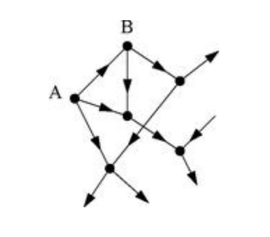

# 一.度中心性

## (1)简介
历史上第一个也是概念上最简单的是度中心性，它被定义为一个节点上关联的链接数（即一个节点具有的连接数）。这种程度可以用节点捕获网络中的任何信息（如病毒或某些信息）的直接风险来解释。在有向网络的情况下（关系有方向），我们通常定义度中心性的两个独立度量，即入度和出外度。入度是指向节点的连接数的计数，出度是节点指向其他节点的连接数。当关系与一些积极的方面如友谊或合作联系在一起时，入度通常被解释为受欢迎的程度，出度是合群的程度。


## (2)计算方法
给定节点数为$|V|$、边数为$|E|$的图$G:=(V,E)$，节点$v$的度中心性被定义为：
$$
C_D(V)=deg(v)
$$
计算图中所有节点的度中心度时，图的稠密邻接矩阵采用$\theta(V^2)$表示，边的稀疏矩阵采用$\theta(E)$表示。

节点级的中心性定义可以扩展到整个图，在这种情况下，我们谈论的是图的中心化。设$v^*$为$G$中中心度最高的节点。设$X:=(Y,Z)$为最大化以下数量的|Y|-节点连通图，最大化以下数量（$y^*$为$X$中中心度最高的节点）：
$$
H=\sum_{j=1}^{|Y|}[C_D(y^*)-C_D(y_j)]
$$
相应地，图$G$的集中度如下所示：
$$
C_D(G)=\frac{\sum_{i=1}^{|Y|}[C_D(v^*)-C_D(v_i)]}{H}
$$
当图X包含一个中心节点且所有其他节点都连接到该节点时，H的值最大化（星形图），在这种情况下$H=(n-1)·((n-1)-1)=n^2-3n+2$
所以，对任何图$G:=(V,E)$,
$$
C_D(G)=\frac{\sum_{i=1}^{|Y|}[C_D(v^*)-C_D(v_i)]}{|V|^2-3|V|+2}
$$
此外，一个新的广泛的全球性的度中心性度量，名为制造中心趋势（TMH），定义如下：
$$
TMK=\frac{\sum_{i=1}^{|V|}[deg(V)]^2}{\sum_{i=1}^{|V|}[deg(V)]}
$$
其中，TMH随着网络中度中心性的出现而增加。

## (3)相关概念
度中心性只是衡量节点中心性的指标之一，以下举出其它三个衡量节点中心性的主要指标：  

接近中心性（Closeness Centrality）。反映在网络中某一节点与其他节点之间的接近程度。  

中介中心性/中间中心性(Between Centrality) 。以经过某个节点的最短路径数目来刻画节点重要性的指标。  

特征向量中心性（Eigenvector Centrality）。一个节点的重要性既取决于其邻居节点的数量（即该节点的度），也取决于其邻居节点的重要性。

# 二.特征向量中心性

## (1)简介
特征向量中心性（Eigenvector Centrality）是简单度中心性的自然扩展。一个节点的重要性既取决于其邻居节点的数量（即该节点的度），也取决于其邻居节点的重要性。

## (2)计算方法
假设节点i的中心性为$x_i=1$,计算出i节点的邻居节点中心性之和$x_i^{'}$，即：
$$
x_i^{'}=\sum_{j}A_{ij}x_j \qquad(1)
$$
其中$A_{ij}$是邻接矩阵的一个元素。这个式子也可以用矩阵表示为$x^{'}=Ax$,$x$是以$x_i$为元素的向量。为了得到更好的估计我们重复这个过程,重复t次之后可以得到中心性向量$x(t)$：
$$
x(t)=A^tx(0) \qquad (2)
$$
现在，让我们将$x(0)$写成邻接矩阵特征向量$v_i$的线性组合：
$$
x(0)=\sum_{i}c_iv_i \qquad (3)
$$
其中$c_i$为合适的比例常数。那么：
$$
x(t)=A^t\sum_{i}c_iv_i=\sum_{i}c_ik_i^tv_i=k_1^t\sum_{i}c_i[\frac{k_i}{k_1}]^tv_i \qquad (4)
$$
其中$k_i$是$A$的特征值，$k_1$是最大特征值。由于$i\neq1$时$k_i/k_1<1$，t变大，除了第一次衰减外，和中的所有项都呈指数衰减，因此在$t\rightarrow\infty$时我们可以得到$x(t)\rightarrow c_1k_1^tv_1$。
换句话说，节点中心性的极限向量与邻接矩阵的前导特征向量成正比。同样地，我们可以说中心性$x$满足
$$
Ax=k_1x \qquad (5)
$$
这就是特征向量中心性，由Bonacich于1987年首次提出。正如前文所得到的，节点i的中心度与其邻居节点中心度之和成正比：
$$
x_i=k_1^{-1}\sum_{j}A_{ij}x_j \qquad (6)
$$
这给了特征向量中心性一个很好的特性，即一个节点的中心性很大，可以是因为这个节点有许多的邻居节点，也可以是因为它有重要的邻居节点（或者两者都有）。

## (3)注意事项
请注意，所有节点的特征向量中心性均为非负。要理解这一点，我们可以考虑如果初始向量$x(0)$恰好只有非负元素会发生什么。因为邻接矩阵的所有元素也是非负的，所以和$A$的乘法永远不会引入任何负元素到向量中，并且等式(2)中的$x(t)$必须具有所有非负元素。

等式(5)没有固定特征向量中心性的标准化，尽管通常这并不重要，因为我们只关心哪些节点具有高或低中心性，而不关心绝对值。但是，如果我们愿意，我们可以通过要求它们和为n来标准化中心性（这确保了平均中心性在网络变大时保持不变）。

## (4)局限性

  
图1：有向网络的一部分。该网络中的节点A只有输出边，因此特征向量中心性为零。顶点B有向外的边和一条向内的边，但向内的边起源于A，因此节点B的中心性也为零。理论上，可以计算无向或有向网络的特征向量中心度。然而，它最适合于无向情况。在有向情况下，会出现其他并发症。首先，有向网络有一个通常不对称的邻接矩阵，这意味着它有两组特征向量，左特征向量和右特征向量，因此有两个前导特征向量。那么我们应该用这两组中的哪一个来定义中心性呢？在大多数情况下，正确的答案是使用右特征向量。原因是在有向网络中，中心性通常是由指向自身的其他节点赋予的，而不是由自身指向其他节点赋予的。因此，有向网络中节点i的特征向量中心度的正确定义应是：节点i与指向它的节点的中心性成正比
$$
x_i=k_1^{-1}\sum_{j}A_{ij}x_j \qquad (7)
$$
但即使这样有向网络的特征向量中心性依然有问题。在图1中，节点A只有输出边没有输入边，这样一个节点的中心性始终为零，因为等式(7)中的和中没有项。而节点B由于只有来自A的输入边，中心性也为零(等式(7)中的和中有一项为零)。更进一步，我们看到一个节点可能会被其它节点指向，而其他节点也会被更多节点指向，以此类推，经过很多节点，但是如果最终到达一个或多个输入边为零的节点，这一切都是徒劳的——中心性的最终值仍然是零。  


# 三.R语言实现与验证
```
library(igraph)  
init.igraph<-function(data,dir=F,rem.multi=T)  
             {  
               labels<-union(unique(data[,1]),unique(data[,2]))  
               ids<-1:length(labels);names(ids)<-labels  
               from<-as.character(data[,1]);to<-as.character(data[,2])  
               edges<-matrix(c(ids[from],ids[to]),nc=2)  
               g<-graph.empty(directed = dir)  
               g<-add.vertices(g,length(labels))  
               V(g)$label=labels   
               g<-add.edges(g,t(edges))  
               if (rem.multi)  
                 {  
                   E(g)$weight<-count.multiple(g)  
                   g<-simplify(g,remove.multiple = TRUE,  
                   remove.loops = TRUE,edge.attr.comb = "mean")  
                 }  
               g  
             }  
 
dat <- data.frame(node1 = c("A","A","A","B","B","C","E"),node2 = c("B","C","E","D","F","E","F"))  
g <- init.igraph(dat,dir=F,rem.multi=T)  
```
## (1)点度中心性——点出度、点入度、相对点中心度、点度频率  
```
degree(g,mode="total")    
degree(g,normalized = T)    
degree.distribution(g) 
```
## (2)点的特征向量中心性——evcent
```
evcent(g,scale = F)$vector  

```
--------------------
#### 参考文献

- [1] 维基百科 https://en.jinzhao.wiki/wiki/Centrality#Degree_centrality
- [2] CSDN https://blog.csdn.net/wlt9037/article/details/75308981
- [3] Newman M.E.J.. Networks: An Introduction[J]. astronomische nachrichten, 2010.
