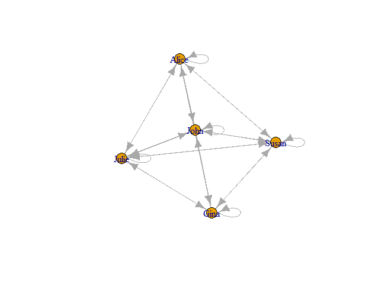

# 邻接矩阵和邻接表（The adjacency matrix and adjacency list）

## 1.简介

邻接矩阵（Adjacency Matrix）提供了在计算机上表示网络的最简单的方法之一，即用计算机代码所提供的二位数组直接在内存中存储邻接矩阵。邻接矩阵优势在存储小型矩阵或密集网络较为显著。同样，邻接矩阵也具有局限性，对于稀疏网络，邻接矩阵对计算机内存的利用效率很低。
至此，就可以引出邻接列表即一组列表，可以紧凑地表示稀疏图，存储网络的完整邻接矩阵的最简单的替代方法，也是计算机算法中使用最为广泛的网络表示。

## 2.邻接矩阵（Adjacency Matrix）

### （1）邻接矩阵的表示：
步骤：
第一步：建立一个顶点表和一个邻接矩阵
第二步：判断待表示的图的类型（无向图、有向图、无向加权图、有向加权图）
第三步：根据不同图对应的邻接矩阵表示法得到不同的邻接矩阵

### （2）分类：（以下代码为节点链接图的实现）

#### 1）无向图：
```{r}
library(igraph)
g <- graph(c(1,2,1,5,2,3,2,4,2,5,3,4,4,5),directed = FALSE) ;plot(g)
```

#### 2）有向图：
```{r}
actors <- data.frame(name=c("1", "2", "3", "4", "5"),
age=c(48,33,45,34,21));
relations <- data.frame(from=c("1", "1", "2", "2","3", "3","4"),to=c("2", "3", "3", "4", "4", "5","5"))
g <- graph_from_data_frame(relations, directed=TRUE, vertices=actors)
plot(g)
```

#### 3）无向加权图：
```{r}
g <- graph(c(1,2,1,5,2,3,2,4,2,5,3,4,4,5),directed = FALSE) ;
g <- set_graph_attr(g,'weight',m[,3]) 
graph_attr(g,'weight')#得到g的权
plot(g,edge.label = graph_attr(g,'weight'))
```

#### 4）有向加权图：
```{r}
g <- set_graph_attr(g,'weight',m[,3]) 
graph_attr(g,'weight')#得到g的权
plot(g,edge.label = graph_attr(g,'weight'))
```

### （3）邻接矩阵的优缺点：

#### 1) 优点：

如果希望在给定的一对顶点之间添加或删除边，可以使用邻接矩阵快速实现。

例如，要在顶点i和j之间添加边，只需给邻接矩阵的横坐标为i纵坐标为j的元素增加1；若要删除相同顶点之间的边，请将元素减少1。无论网络大小如何，这些操作都会花费恒定的时间，因此它们的计算复杂度为O（1）；类似地，如果我们想测试给定的一对顶点i和j之间是否有边，我们只需要检查相应矩阵元素的值，这也可以在O（1）时间内完成。

另外，由于无向网络是由对称矩阵表示的，所以它对这个问题有一点复杂。如果我们想在顶点i和j之间添加一条无向边，那么原则上我们应该将邻接矩阵的横坐标为i纵坐标为j的元素和横坐标为j纵坐标为i的元素都增加1，但实际上这是一种浪费时间的方法。更好的方法是只更新矩阵上三角中的元素，而将下三角保留为空，因为我们知道其正确值只是上三角的镜像。换句话说，我们只更新矩阵中i<j的元素（i，j）。例如，如果我们希望在顶点2和顶点1之间创建一条边，原则上这意味着我们希望将邻接矩阵的（2，1）元素和（1，2）元素都增加1。但是，因为我们只更新i<j的元素，所以我们只增加（1，2）元素，而不增加其他元素。

进一步考虑，我们根本无法将邻接矩阵的下三角存储在内存中。如果我们不打算更新它，就没有必要浪费内存来存储它。但是，去掉矩阵的下三角形会使剩下的矩阵本身变成三角形，而且大多数计算机语言都不包含用于保存三角形数量集的数组。通过一定量的工作，可以使用例如C和JAVA等语言提供的动态内存分配工具来安排存储三角矩阵，但只有当内存空间是执行计算的限制因素时，这才是值得做的。

#### 2)局限性：

##### a.
邻接矩阵并不总是一种方便的表示形式。
例如，如果我们想快速遍历某个特定顶点的邻域（至少是在稀疏图上），这是很麻烦的。顶点i的邻域由邻接矩阵第i行中的非零元素表示，为了找到它们，我们必须逐个遍历该行的所有元素，寻找非零元素。这需要时间O（n）（这是行的长度），这在大型网络中可能需要很多时间，但在稀疏图上，大部分时间都是浪费的，因为每个顶点只连接到其他顶点的一小部分。邻接矩阵中的元素为零。正如我们将在本章中看到的，许多网络算法确实要求我们找到一个顶点的所有邻居，通常是重复的，而对于这种算法，邻接矩阵并不是一个理想的工具。

##### b.
另一个缺点是，对于稀疏图，它对计算机内存的利用效率很低。在邻接矩阵的大多数元素为零的网络中，矩阵占用的大部分内存用于存储这些零。正如我们将看到的，还有其他表示法，如“邻接列表”，可以避免存储零，从而占用更少的空间。
计算存储网络的邻接矩阵消耗了多少内存是一件简单的事情。矩阵有n^2个元素。如果它们中的每一个都是整数（在大多数现代计算机上需要4个字节来存储），那么整个矩阵将占用4n^2个字节。在编写本文时，一台典型的计算机大约有1010字节的RAM（10GB），因此可以以邻接矩阵格式存储的最大网络满足4n^2=1010。这几乎不足以存储当前感兴趣的最大网络，例如Web图的大型子集或大型社交网络，甚至不足以存储一些中型网络。

##### c. 
这里描述的邻接矩阵表示法的缺点主要适用于稀疏网络。如果有人对密集网络感兴趣，即所有可能边的很大一部分都存在的密集网络，那么邻接矩阵格式可能是合适的。在这种情况下，它仍然会占用大量内存，但任何数据格式都会占用大量内存，因为只需要存储大量信息，所以其他格式的优势就不那么显著了。如果只对相对较小的网络感兴趣，那么邻接矩阵也可能是一个不错的选择。例如，社交网络分析软件包UCINET主要针对与较小网络合作的社会学从业者，专门使用邻接矩阵格式。然而，目前大多数关于网络的研究都集中在较大的数据集上，对于这些数据集，则需要另一种表示。

## 3.邻接列表（adjacency list）

### （1）邻接列表的表示：

步骤：
第一步：建立一个顶点表
第二步：判断待表示的图的类型
第三步：根据不同图的邻接列表表示法得到不同的邻接列表

### （2）分类：（做以下关系网络图的代码同邻接矩阵的分类）

 1）无向单邻接列表
 
 2）列出每个顶点输出边或输入边的有向单邻接列表
 
 3）同时列出每个顶点输出边以及输入边的双邻接列表
 
 4）有向加权图
 
 5）无向加权图

### （3）邻接列表的优缺点：

#### 1）优点：

##### a. 
考虑在邻接矩阵部分所考虑的四个基本网络操作，边缘的加法和移除，查找是否存在边，以及连接到顶点的所有边的枚举。我们可以很快地向网络中添加一条边：要添加一条边（i，j），我们只需在顶点i和j的相邻列表的末端各添加一个新条目，这需要时间O（1）。

##### b. 
当我们需要快速遍历一个顶点的邻接点时，邻接列表就有了自己的功能，这是许多网络计算中的常见操作，我们可以很容易地完成这项工作，只需浏览存储的邻居列表即可。我们所讨论的顶点，其所需时间与相邻顶点的数量成比例，平均为c=2m/n。因此，该运算的前导阶时间复杂度为O（m/n），远好于相同运算的邻接矩阵的O（n）。

#### 2）局限性：
查找或删除边有点困难。为了确定顶点i和j之间是否存在边，我们需要查看i的邻域列表，以查看j是否出现在该列表中，反之亦然。因为邻居列表没有特定的顺序，所以没有比从一开始就一步一步地浏览整个列表更快的方法了。在最坏的情况下，我们将检查所有元素，以找到我们的边缘或确认它不存在，在平均值上，这将按顺序计算列表中元素的平均数c，由平均度等式给出。因此，对于邻接列表形式的网络，“查找”操作需要时间O（m/n）。这比使用邻接矩阵的相同操作稍微慢一点，这需要时间O（1）。在具有常数平均度的稀疏图上，使m∝ n，O（m/n）≡ O（1），因此从技术上讲，邻接列表的复杂度与邻接矩阵的复杂度一样好，但在实践中，前者将比后者慢一个常数因子，如果平均度较大，该常数因子可能会变大。
改进：通过移动最后一个元素“2”覆盖列表，可以从列表中删除元素“1”。
删除边需要首先找到它，这需要时间O（m/n），然后删除它。删除操作可以在O（1）时间内完成，只需移动邻居列表中的最后一个条目，覆盖已删除边的条目，并将顶点的阶数减少一。（如果没有最后一个元素，那么我们只需将阶数减少一即可）。因此，边缘移除操作的前导顺序运行时间为O（m/n）。

### （4）注意：
逆邻接表通常不要求邻接列表中顶点的邻居以数字顺序出现。通常情况下，它们可以以任何顺序出现。

## 4.实例：

以下为用简单的例子解释相关的概念。
假设有五个人，分别叫Alice、John、Julie、Gina、Susa。他们互相之间的关系程度（一定时间内互相打电话的次数）用取值范围从1到5的变量relationship来表示，数值越大表示关系越亲密。

```{r}

library(igraph)
library(dplyr)
phone.call<-read.csv("C:/Users/lenovo/Desktop/phone.call.csv")
head(phone.call)##由数据可见，这是一个由source（一个人）指向destination（目标即另一个人），以亲密程度为权重的有向加权网络。
##从邻接矩阵建立网络对象
library(tidyverse)
name<-data.frame(c(phone.call$source,phone.call$destination))
nodes<-name%>%distinct()%>%##提取独特的行观测量
mutate(location=c("western","western","central","nordic","southeastern"))
colnames(nodes)<-c("label","location")##我们创建一个新变量location，表示这些每个节点的地理位置
edges<-phone.call%>%
    rename(from=source,to=destination,weight=n.call)##下面来看边列表。数据集phone.call的前两列分别表示了边出发和终结的节点。所以这个数据集就是边列表的形式，第三列n.call可以作为边的权重。
#edge <- merge(edges,nodes,by.x="from",by.y = "label",all.x = TRUE)
net_pc <- graph_from_data_frame(d=edges,directed=TRUE)
net_pc##可以看到输出的igraph对象
##运行显示结果解释：329e987是这个对象的名称，DNW- n m --表示这是一个有向（D）、有命名（N）且加权（W）的网络，它有n个节点和m条边。它具有的节点属性是name , location ，具有的边属性是weight
V(net_pc)
#V(net_pc)$location 
##我们可以通过V()和E()对节点和边的属性进行访问
###提取边列表
as_edgelist(net_pc, names=T) 
###提取邻接矩阵
as_adjacency_matrix(net_pc, attr="weight")
plot(net_pc)##运行出节点链接图
write.csv(phone.call, "phone.call.csv")

```

以下图为五人关系图：



## 5.后记：

### （1）由分别对邻接矩阵和邻接表优缺点的分析总结出的对比如下：

1）密集图且顶点较少、无权值的图结构适宜用邻接矩阵来表示，稀疏图且顶点较多、无权值的图结构适宜用邻接列表来表示；

2）邻接矩阵码量少，对边的存储、查询、更新等操作快而简，只需一步即可访问和修改，而邻接列表码量较大，访问和修改等操作会变慢；

3）邻接矩阵空间复杂度高，一般情况下无法存储重边；而邻接列表空间复杂度优，可以存储重边。

### （2）邻接矩阵的发展趋势

随着科学技术的发展，数据规模的不断扩大，实体间的关联也越加复杂，如何建立有效的交互方式帮助用户正确地理解和探索网络，进一步将人的智能与机器的智能有机结合，辅助用户发现动态网络的并预测将来的发展趋势都将成为未来研究中需要着重考虑的问题。

## 6. 参考文献：

[1]  陈谊，张梦录，万玉钗.图的表示与可视化方法综述[J].系统仿真学报，2001，32(7)：1233-1243.

[2] M.E.J.Newman.Networks An introduction[M].283-288.
