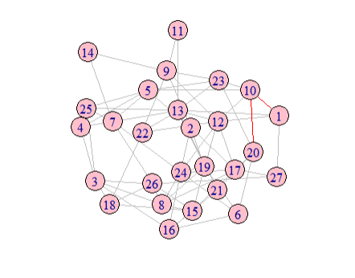
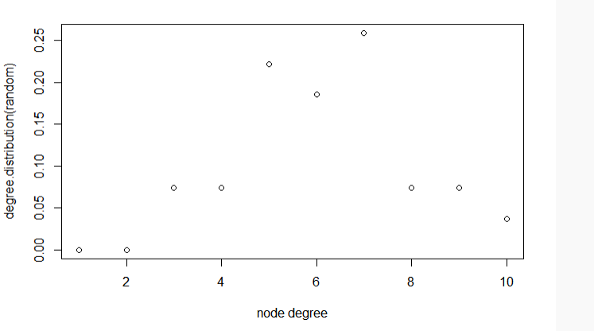

```{r setup, include=FALSE}
knitr::opts_chunk$set(echo = TRUE)
```

## 一、简介

&emsp;&emsp;网络科学旨在建立能够再现真实网络特性的模型。我们遇到的大多数网络都没有晶格的舒适规律性或蜘蛛网的可预测的径向结构。相反，在第一次检查时，它们看起来就像是随机旋转的。随机网络理论通过构造和描述真正随机的网络来拥抱这种明显的随机性。

&emsp;&emsp;从建模的角度来看，网络是一个相对简单的对象，只由节点和链接组成。然而，真正的挑战是决定将节点之间的链接放在哪里，以便我们重现一个真实系统的复杂性。在这方面，随机网络背后的理念很简单，我们假设这个目标最好通过在节点之间随机放置链接来实现。但这需要我们先了解随机网络的定义：一个随机网络由N个节点组成，每个节点都与概率p连接。


## 二、随机网络模型G(N, p)

&emsp;&emsp;要构建一个随机网络，我们遵循以下步骤：

1.从N个孤立的节点开始。

2.选择一个节点对，并生成一个介于0到1之间的随机数。如果数字超过p，请将所选节点对与链接连接，否则将让它们断开连接。

3.对N(N-1)/2个每个节点对重复步骤（2）。

&emsp;&emsp;在此过程后得到的网络称为随机图或随机网络。

&emsp;&emsp;使用相同的参数N、p生成的每个随机网络看起来略有不同。不仅详细的接线图在实现之间发生了变化，而且链接的数量L也发生了变化。因此，确定我们期望对一个N和p固定的随机网络的特定实现有多少个链路是有用的。

一个随机网络有L个链路的概率是以下三项的乘积：

1.L次尝试连接N(N-1)/2对节点的概率导致了一个链接，即$p^{L}$。

2.剩余的N(N-1)/2-L尝试未导致链接的概率，即 $$(1-p)^{N(N-1)/2-L}$$ 。

3.组合因子，$$\begin{pmatrix} N(N-1)/2\\ L\end{pmatrix}$$，计算我们可以在N（N-1）/2个节点对中放置L个链接之间的不同方法的数量。

&emsp;&emsp;因此，我们可以写出随机网络的特定实现具有L链接的概率 $$\begin{pmatrix} N(N-1)/2\\ L\end{pmatrix}\cdot p^{L}\cdot (1-p)^{(N(N-1)/2)-L}$$ 。

&emsp;&emsp;总之，一个随机网络中的链路数量在不同的实现中有所不同。其期望值由N和p决定。如果我们增加p，一个随机网络将变得更加密集：平均链接数从$<L>$=0到$L_{max}$线性增加，一个节点的平均程度从$<k>$=0增加到$<k>$=N-1。


## 三、随机网络的四条性质

（1）度分布：
  
&emsp;&emsp;与节点i连接的边的总数目称为节点i的度，度是描述网络局部特性的基本参数，对网络中所有节点的度求平均称为平均度$<k>$。度分布函数反映了网络的宏观统计特征，一般来说，如果网络的度分布呈现泊松分布则称之为随机网络。
  
&emsp;&emsp;一个随机网络的度分布的确切形式是二项式分布（左半部分）。对于N≫$<k>$，二项式可以很好地近似于泊松分布（右半部分）。由于这两个公式描述了相同的分布，它们具有相同的性质，但它们用不同的参数表示：二项分布依赖于p和N，而泊松分布只有一个参数，$<k>$。正是这种简单性使得泊松形式在计算中成为首选。

（2）连通性：
  
&emsp;&emsp;无向图的连通性为该子图中的任意两个顶点之间都存在路径。有向图分为强连通（图中任意两个顶点u，v之间，既存在u到v的路径也存在v到u的路径）和弱连通（把所有有向边看作无向边后得到的无向图是连通的）。据随机网络理论预测，对于$<k>$>1，我们观察到一个巨大的分量，检查的所有网络都满足条件。然而，大多数网络并不满足$<k>$>lnN条件，这意味着它们应该被分解成孤立的集群。有些网络确实是分散的，而大多数则不是。

（3）平均路径长度：
  
&emsp;&emsp;节点i和j之间的距离$d_{ij}$定义为连接这两个节点的最短路径上的边的数目，也称为两个节点之间的测地距离或跳跃距离。$$L= \frac{1}{\frac{1}{2}N(N-1)}\sum_{i\geqslant j}d_{ij}$$
  
&emsp;&emsp;随机网络理论预测，平均路径长度遵循 $$<d> \approx \frac{lnN}{ln<k> }$$ ，这一预测为观察到的路径长度提供了一个合理的近似。因此，随机网络模型可以解释小世界现象的出现。

（4）聚类系数：
  
&emsp;&emsp;在一个随机网络中，局部聚类系数独立于节点的度，$<C>$依赖于系统大小为1/N。
  
$$C_{i}=\frac{E_{i}}{(k_{i}(k_{i}-1))/2}=\frac{2E_{i}}{k_{i}(k_i-1)}$$，$E_{i}$是节点i的$k_{i}$个邻节点之间实际存在的边数。


## 四、r中生成简单的随机图

```{r}

#随机生成一个图
library(igraph)
random<-erdos.renyi.game(27,0.2,type=c("gnp", "gnm"),directed=F)
#gnm<-sample_gnm(10,20,directed = F)#基于gnm生成图
#gnp<-sample_gnp(10,0.3,directed = F)#基于gnp生成图
V(random)$color<-"pink"#设置顶点颜色
V(random)$size<-20#设置顶点大小
E(random)$color<-"grey"#设置边颜色
pa<-get.all.shortest.paths(random,1,20)$res[[1]]#最短路径算法
E(random,path=pa)$color<-"red"#设置路径边的颜色

plot(random,layout=layout.fruchterman.reingold)#绘制图
plot(degree.distribution(random), xlab="node degree")#度分布
mean_distance(random)#计算平均路径长度
transitivity(random)#计算聚类系数

```




## 五、总结与反思

&emsp;&emsp;自1959年引入以来，随机网络模型一直主导了复杂网络的数学方法。该模型表明，在复杂系统中观察到的随机外观网络应该被描述为纯随机的。因此，它等同于复杂性和随机性。但是，真实的网络并不是随机的。事实上，我们怀疑在大多数复杂的系统背后都存在一个深层的秩序，这种顺序必须反映在描述其体系结构的网络结构中，从而导致系统偏离纯随机配置。随机网络描述或无法描述真实系统的程度，不能由认识论的论据来决定，而是由系统的定量比较来决定，但是我们可以利用随机网络理论做出一些定量预测。


## 六、参考文献

[1]Albert-Laszlo Barabasi.Network Science[M].2014

[2]汪小帆，李翔，陈关荣.网络科学导论[M].2012

[3]柴剑平，王妍，倪业鹏，王小宁.传媒数据学[M].2021
