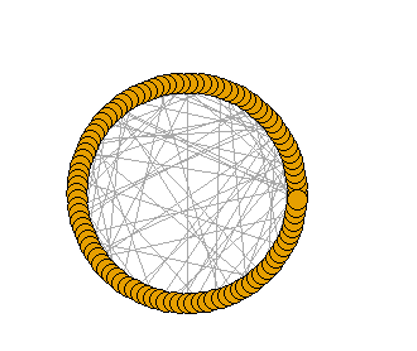
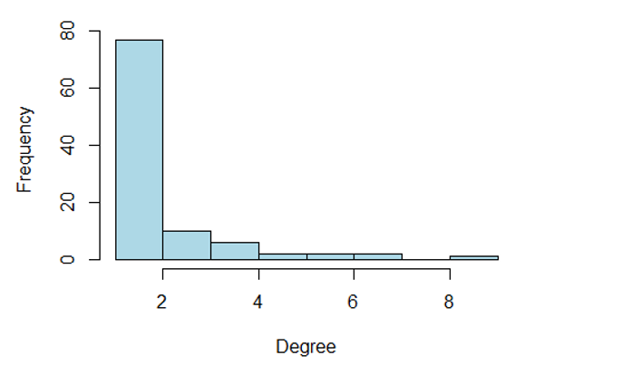

Preferential Attachment
2020213053023朱良栋正
2021/10/18
# （一）定义
在此之前的许多网络模型中，都是基于固定的网络参数，例如固定的定点数量和边或者度数分布，这都是由建模者自己决定的。但是这类模型没有给出任何解释：为什么网络首先应该有幂律度分布。而有一种模型叫生成网络模型，也就是说，他们对机制进行建模。通过它来创建网络。这些模型背后的想法是探索假设，看看它们产生了什么样的结构。如果结构类似于我们在现实世界中观察到的网络表明（尽管没有证明），那么生成机制可能在真实网络中起作用。由此想法创建出了优先连接模型。 第一个提出这个问题的人是20世纪70年代的price，网络为什么是这样一个分布？他对科学论文的引用网络很感兴趣，在20世纪60年代撰写了一篇关于这个主题的重要论文，他在论文中指出了幂律 在这些网络中看到的度数分布。然后， Barabá和Albert的随机网络，也常被称为BA随机网络。而现在，我们更多依据1999年巴拉斯和阿尔伯特的说法，称之为优先连接模型。
# (二) 理论
巴拉斯和阿尔伯特基于优先连接机制提出这样的随机网络模型：以通过边连接的两个节点的初始网络G开始，逐步往网络G中添加一个度m≥1的新节点；新节点会随机选择网络中的一个现有节点连接，但会有一定偏差，更具体地说，网络中已有节点被选择的概率与它已经具有的连接数（度）成正比，这就是所谓的“优先连接”机制。 
从一个有 N_v^{(0)} 个节点、 N_e^{(0)} 条边的初始图 G^{(0)} 开始，在 t=1,2,... 的每一步，当前图 G^{(t-1)} 会增加一个度为 m\ge1 的新节点而产生新的图 G^{(t)} .
经过 t 次迭代，产生的图 G^{(t)} 将包括 N_v^{(t)}=N_v^{(0)}+t 个节点和 N_e^{(t)}=N_e^{(0)}+tm 条边。随着t增加，逐渐产生具有相对较高度的节点
# （三）举例 
1、经济学家西蒙注意到了price的论文，由此对财富分配提出了一种解释，其基础是，有钱的人已经以与他们已经拥有的成比例的速度获得了更多财富。”富人会变得更富”这种效应可以导致power-law分布。Price接受了他的方法，并将之成为“积累优势”。富人就相当于度更多的结点，因此，更多的结点便会优先连接这个结点。这就类似于优先连接模型。
2、除了前面提到的例子外，更直观的是微博的社交网络。明星和大V可以有上千万粉丝，而笔者这种小白可能只有几个粉丝（还包括营销号和自己的小号）。又如，在城市之间的快递流通当中，总是有少数的城市向全国发出了大部分的快递，在这个网络中承担重要的中转功能。
# （四）代码实现
在R中，可直接使用igraph包中的barabasi.game函数模拟生成BA随机网络。 参考以下示例，生成节点数n=100，每个新节点增加m=1条边。
knitr::opts_chunk$set(echo = TRUE)
library(igraph)
## Warning: 程辑包'igraph'是用R版本4.1.1 来建造的
## 
## 载入程辑包：'igraph'
## The following objects are masked from 'package:stats':
## 
##     decompose, spectrum
## The following object is masked from 'package:base':
## 
##     union
set.seed(42)
g.ba<-igraph::barabasi.game(100,directed = FALSE)
plot(g.ba,layout=layout.circle(g.ba),vertex.label=NA,
     vertex.size=20)
     
hist(degree(g.ba),col="lightblue",
     xlab="Degree",ylab="Frequency",main="")
     
     summary(degree(g.ba))
##    Min. 1st Qu.  Median    Mean 3rd Qu.    Max. 
##    1.00    1.00    1.00    1.98    2.00    9.00
# (五）性质
  1、并可以初步观察到它的节点度大致为幂律分布，即总体分布上具有很强异质性，符合无标度网络的一般特征：大部分节点的连接度较小，少部分节点具有很高的连接度，出现枢
  纽节点。
  2、BA模型生成的网络特点：①节点对间最短路径上的节点相对较少；②聚集性较低。
  3、优先连接模型的性质：当t趋于无穷时，图 G^{(t)} 的度分布趋于一个幂指数 \alpha=3 的幂律分布 d^{-\alpha}
  # （六）参考文献 
(1)Networks An introduction –M.E.J.Newman.978-0-19-920665-0 (Hbk.)
(2)Barabá, Albert S. Emergence of Scaling in Random Networks. Science, 1999, 286(5439):509-512.
