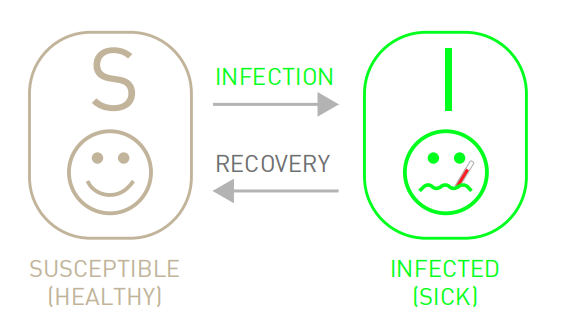
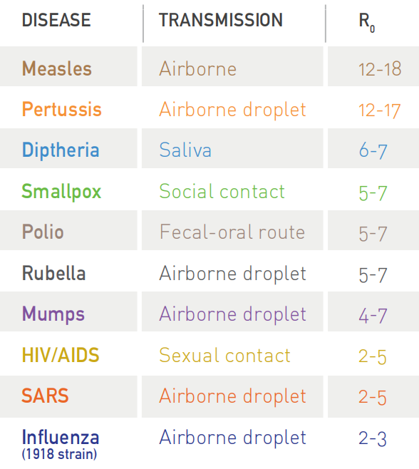
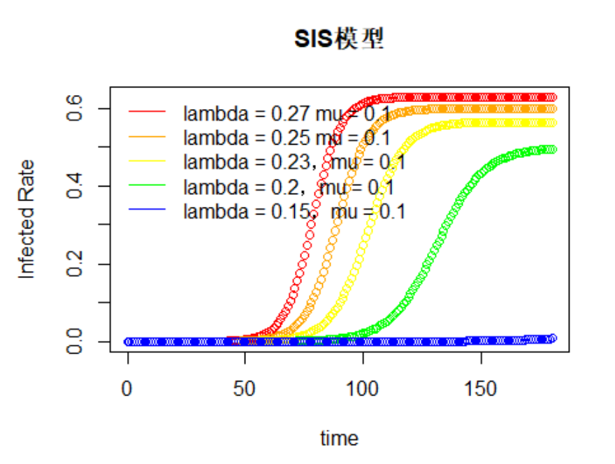

```{r setup, include=FALSE}
knitr::opts_chunk$set(echo = TRUE)
```

# 一、前言

在流行病学的研究中，针对病原体的传播，研究者们已经开拓出了一个鲁棒性强大的框架对其进行模拟，该框架依赖于两个基本的假设：

## （一）类型区分

各类流行病模型可以根据个体的疾病阶段对其进行分类，最简单的分类是假设一个人可以处于如下三种状态中的一种：

### · S类

易感者，指尚未接触到病原体的但免疫能力弱的健康个体，容易遭受病原体侵入进而患病。

### · I类

患病者，指接触病原体且可以感染给未患病人群的传染性个体。

### · R类

康复者，指过去已被感染但现在恢复健康的个体，不具有传染性。

个体可以在上述三种状态间进行转换，如健康个体（S类或者R类）接触到I类个体后可能被同化，进而患病；而I类个体经过治疗也可能重新恢复健康状态。总之，各类流行病模型均存在着相应的动态转换路径，具体的转换途径据传染性强弱、免疫周期、致死率等因素的不同而不同。

## （二）均匀混合

假设每个人与感染者（I类）接触的机会均等，该假设消除了了解疾病传播中精确接触网络的需要，进而提出了每个人都可以感染其他人的假设。

本文介绍的SIS模型就基于上述两种假设。

# 二、SIS模型介绍

在现实生活中，大多数的病原体最终会被免疫系统或者药物治疗击败，因此受感染个体会康复转变为健康个体，如日常的感冒和发烧等。但与SIR模型中感染个体恢复后处于移除状态不同的是，SIS模型中受感染个体将以固定速率 $\mu$ 恢复，再次变为易感者（S类）。




## （一）模型假设

(1) SIS模型假设总人群只分为易感者（S）和患病者（I）两类，且两者会发生转化。

(2) 假设人口不发生迁移且不考虑人的出生与死亡的影响，故人口总数在SIS模型中不发生变化。

(3) 假设总人口数为N，在t时刻S类和I类人群占总人数的比率为s(t)、i(t)，有$s(t)+i(t) = 1$，因此S类人群数量 $S(t) = N\times s(t)$，I类人群数量 $I(t) = N\times i(t)$，故初始时刻S类人群数量为 S(0)，I类人群数量为I(0)。

(4) 假设每个患病者每日会与 $\lambda$ 位易感者发生有效接触，这当中因此患病的占 s(t)，即每个患病者每日会使 $\lambda\times s(t)$ 个易感者患病，故单日新增患病者数为 $N\times i(t)\times\lambda\times s(t)$。

(5) 假设每日受感染者以固定速率 $\mu$ 恢复，变为易感者，则每日治愈的感染者总数为 $N\times i(t)\times\mu$。

## （二）构建模型

根据假设可知，单日患病者数变化 = 新增患病者数 - 治愈患病者数，故可得微分方程：
$$N\times\frac{di(t)}{dx} = N\times i(t)\times\lambda\times s(t) - N\times i(t)\times\mu$$
单日易感者数变化 = 治愈患病者数 - 新增患病者数，故有：
$$N\times\frac{ds(t)}{dx} = N\times i(t)\times\mu - N\times i(t)\times\lambda\times s(t)$$
两边消去总人数N可得：
$$\frac{di(t)}{dx} = i(t)\times\lambda\times s(t) - i(t)\times\mu$$
$$\frac{ds(t)}{dx} = i(t)\times\mu - i(t)\times\lambda\times s(t)$$
同时有：
$$s(t)+i(t) = 1$$
将$s(t) = 1 - i(t)$代入$\frac{di(t)}{dx} = i(t)\times\lambda\times s(t) - i(t)\times\mu$中，可得：
$$\frac{di(t)}{dx} = i(t)\times\lambda\times(1 - i(t)) - i(t)\times\mu$$
化简一下：
$$\frac{di(t)}{dx} = i(t)\times(\lambda-\mu) - \lambda\times i(t)^2$$
利用伯努利不等式解法可求解得：

当$\lambda = \mu$时，有：
$$i(t) = \frac{i(0)}{\lambda\times t\times i(0) + 1}$$

当$\lambda \neq \mu$时，有：
$$i(t) = \frac{1}{\frac{\lambda}{\lambda - \mu} + (\frac{1}{i(0)} - \frac{\lambda}{\lambda - \mu})\times e^{-(\lambda - \mu)\times t}}$$
引入基本传染数 $R_0 = \frac{\lambda}{\mu}$，化简上述结果可得：
$$i(t) = {\frac{1}{1 - \frac{1}{R_0}} + \frac{i(0)\times(1 - \frac{1}{R_0})\times e^{(\lambda - \mu)\times t}}{(1 - \frac{1}{R_0}) - i(0)}}$$

## （三）模型结论

与SI模型预测最终结果为所有人都感染不同，由上式可知，在SIS模型中，流行病有两种可能的结果：

### 当 $\mu < \lambda$ 时

基本传染数 $R_0 > 1$，此时有：
$\lim_{t \to \infty} i(t) = 1 - \frac{1}{R_0}$

由上式可知，当 $t \to \infty$ 时，若 $R_0 = \frac{\lambda}{\mu} > 1$，由于 $\lambda$、$\mu$ 均为常数，则$R_0$ 为一个大于1的常数，故对应的 $i(\infty)$ 为一个小于1的常数，因此在这种流行状态下，由于总人数N不变，最终患病人数也将趋于一个定值 $N\times i(\infty)$，此时新感染人体数等于患病者康复数，对应有 $\frac{di(t)}{dx} = 0$。

在这种情况下，若基本传染数 $R_0 \to \infty$，则 $i(t) \to 1$，几乎全部都为患病者。因此对于这种传染性强的传染病，需要通过人为手段（隔离、消杀等）强有力的持续介入，才有可能控制病原体传播。

### 当 $\mu \geq \lambda$ 时

基本传染数 $R_0 \leq 1$，此时有：
$\lim_{t \to \infty} i(t) = 0$

在这种情况下，单位时间治愈的人数超过了新感染的人数，因此，随时间的推移，病原体将逐渐从种群中消失。

由此可知，病原体对应的 $R_0$ 值越大，说明该病的传染性越强，危险性越大；而 $R_0 \to 0$ 时，病原体传染性弱，不会造成社会危害。

下图中显示了几类常见传染病及对应的 $R_0$ 值：



# 三、主要应用

```{r}
rm(list = ls()) # 清除环境变量

library(deSolve) # 调用deSolve包

# 定义微分方程的形式
sis_equations <- function(time,variables,parameters)
{
  with(as.list(c(variables,parameters)),
       {
         di <- lambda*i*(1-i) - mu*i
         return(list(c(di)))
       })
}

# 设置病人的初始占比i = 0.000001
initial_values <- c(i = 0.000001)

# 设置病情发展时间为180天
time_values <- seq(0,180)

# 设置参数值 lambda = 0.27，mu = 0.1
parameters_values <- c(lambda = 0.27,mu = 0.1)

sis_values_1 <- ode(
  y = initial_values,
  times = time_values,
  func = sis_equations,
  parms = parameters_values
)

sis_values_1 <- as.data.frame(sis_values_1)

# 设置参数值 lambda = 0.25，mu = 0.1
parameters_values <- c(lambda = 0.25,mu = 0.1)

sis_values_2 <- ode(
  y = initial_values,
  times = time_values,
  func = sis_equations,
  parms = parameters_values
)

sis_values_2 <- as.data.frame(sis_values_2)

# 设置参数值 lambda = 0.23，mu = 0.1
parameters_values <- c(lambda = 0.23,mu = 0.1)

sis_values_3 <- ode(
  y = initial_values,
  times = time_values,
  func = sis_equations,
  parms = parameters_values
)

sis_values_3 <- as.data.frame(sis_values_3)

# 设置参数值 lambda = 0.2，mu = 0.1
parameters_values <- c(lambda = 0.2,mu = 0.1)

sis_values_4 <- ode(
  y = initial_values,
  times = time_values,
  func = sis_equations,
  parms = parameters_values
)

sis_values_4 <- as.data.frame(sis_values_4)

# 设置参数值 lambda = 0.15，mu = 0.1
parameters_values <- c(lambda = 0.15,mu = 0.1)

sis_values_5 <- ode(
  y = initial_values,
  times = time_values,
  func = sis_equations,
  parms = parameters_values
)

sis_values_5 <- as.data.frame(sis_values_5)


# 作图
with(sis_values_1,{
  plot(time,i,type = 'b',col = "red",main = "SIS模型",ylab = "Infected Rate")
})

with(sis_values_2,{
  lines(time,i,type = 'b',col = "orange")
})

with(sis_values_3,{
  lines(time,i,type = 'b',col = "yellow")
})

with(sis_values_4,{
  lines(time,i,type = 'b',col = "green")
})

with(sis_values_5,{
  lines(time,i,type = 'b',col = "blue")
})

legend("topleft",c("lambda = 0.27 mu = 0.1","lambda = 0.25 mu = 0.1","lambda = 0.23，mu = 0.1","lambda = 0.2，mu = 0.1","lambda = 0.15，mu = 0.1"),
       col = c("red","orange","yellow","green","blue"),lty = 1,bty = "n")
```

生成图片如下：



# 四、参考文献

[1] Albert-Laszlo Barabasi.Network Science[M].2014

[2] Zafarani R., Abbasi M.A., Liu H. - Social Media Mining.An Introduction-CUP (2014)

[3] 汪小帆，李翔，陈关荣.网络科学导论[M].2021
