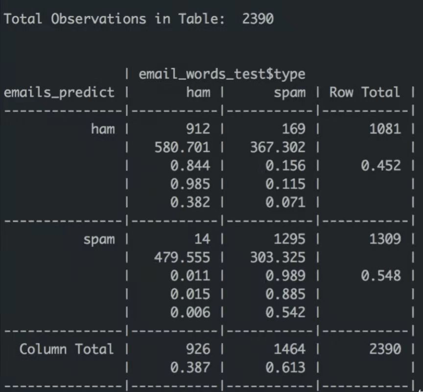

贝叶斯概率模型

一、概念解释
P(A \mid B)=p(B \mid A) p(A) / p(B)
       从理论上讲，贝叶斯概率模型是一种典型的基于结果来求解原因的模型，其中p(A)为先验概率，表示每种类别分布的概率；p(B \mid A)为类条件概率（也称似然概率），表示在某种类别的前提下，某事发生的概率；而  P(A \mid B)为后验概率，后验概率越大，说明某事物属于这个类别的可能性越大。

二、朴素贝叶斯
        在统计学和计算机科学的文献中，提到的通常为贝叶斯概率模型的简化模型朴素贝叶斯，又称简单贝叶斯或独立贝叶斯。本质上，朴素贝叶斯是一种生成式模型，是在贝叶斯算法上做了简化，即假设定给定目标值的条件下，各个特征相互独立，这个简化使得各个特征对分类结果的影响较为平均，一定程度上降低了分类器的分类效果，但是极大的简化了算法的复杂度。朴素贝叶斯自20世纪50年代起被广泛研究，是文本分类的一种热门方法，在实际应用中往往能够取得相当好的结果，被广泛应用于对复杂的现实情况的分析当中。

三、贝叶斯分类器    
        在多数情况下，人们在提到朴素贝叶斯时，更多是指建立在朴素贝叶斯概率模型上的贝叶斯分类器。在机器学习中，朴素贝叶斯分类器是一系列以假设特征之间强独立下运用贝叶斯定理为基础的简单概率分类器。所有的朴素贝叶斯分类器都假定样本每个特征与其他特征都不相关。在实际应用中，朴素贝叶斯模型参数估计使用最大似然估计的方法，也就是说，即便在不使用贝叶斯概率或任何贝叶斯模型的情况下，朴素贝叶斯也能取得很好的效果。
        理论上，概率模型分类器是一个条件概率模型。
p\left(C \mid F_{1}, \ldots, F_{n}\right)
        朴素贝叶斯假设所有的特征变量F之间相互独立，在这样的假设下，贝叶斯概率模型被简化为以下式子：
p\left(C \mid F_{1}, \ldots, F_{n}\right)=\frac{p(C) p\left(F_{1}, \ldots, F_{n} \mid C\right)}{p\left(F_{1}, \ldots, F_{n}\right)}
由于分母只与特征F有关，于是我们可以认为分母是一个常数，这样我们就可以只研究分子，而分子等价于一个联合分布模型
p\left(C, F_{1}, \ldots, F_{n}\right)
又因为朴素贝叶斯假定条件独立，于是p\left(F_{i} \mid C, F_{j}\right)=p\left(F_{i} \mid C\right)
对于i≠j，所有联合分布模型可以表达为\begin{aligned}
p\left(C \mid F_{1}, \ldots, F_{n}\right) & \propto p\left(C, F_{1}, \ldots, F_{n}\right) \\
& \propto p(C) p\left(F_{1} \mid C\right) p\left(F_{2} \mid C\right) p\left(F_{3} \mid C\right) \cdots \\
& \propto p(C) \prod_{i=1}^{n} p\left(F_{i} \mid C\right)
\end{aligned}
在朴素贝叶斯的假设下，类变量C的条件分布可以表达为：
p\left(C \mid F_{1}, \ldots, F_{n}\right)=\frac{1}{Z} p(C) \prod_{i=1}^{n} p\left(F_{i} \mid C\right)
其中Z(证据因子)是一个只依赖于特征F的缩放因子，当特征变量的值已知时是一个常数。所以由于概率模型被分解为类先验概率P(C)与独立概率分布p\left(F_{i} \mid C=c\right)，概率模型的可控性得到了极大的提高，所需要估计的参数数量也得到了极大的减少，因此朴素贝叶斯分类器的一个优势在于只需要根据少量的训练数据就可以估计出必要的参数，且由于变量之间独立假设，只需要估计各个变量的方法，而并不需要确定整个协方差矩阵。

四、参数估计   
    在实际问题当中，我们往往只能获取到有限数目的样本数据，而先验概率和类条件概率(各类的总体分布)都是未知的。根据仅有的样本数据进行分类时，通常需要我们对先验概率和类条件概率进行估计。
    先验概率的估计一般来说较为简单，常用方法是概率的最大似然估计。类的先验概率可以通过假设各类等概率来计算（先验概率 = 1 / (类的数量)），或者通过训练集的各类样本出现的次数来估计（A类先验概率=（A类样本的数量）/(样本总数)）。
    但是类条件概率的估计往往非常困难，因为类条件概率的密度函数包含了一个随机变量的全部信息，而且概率密度函数的估计还受到样本数据数量的限制以及特征向量维度的限制。因此我们需要将概率密度的估计问题转化为参数的估计问题。选取合适的概率密度函数模型，在样本区域足够大时，就可以得到较为准确的参数估计值。

五、样本修正
    如果一个给定的类和特征值在训练集中没有一起出现过，那么基于频率的估计下该概率将为零，与其他概率相乘时将会把其他概率的信息统统去除。为了避免这种情况的产生，所以常常要求要对每个小类样本的概率估计进行修正，以保证不会出现有为零的概率出现。

六、争论
    贝叶斯学派提出了贝叶斯公式与主观概率，他们认为参数可以是一个分布，并且可以由我们的经验赋予先验，也就是说，贝叶斯概率模型可以通过将参数赋予一个方差很大的先验分布，使估计的参数能够让后验概率的方差更小。而概率学派主张大数定律，认为参数应该是一个确定的值而不应该具有随机性。
    而在贝叶斯概率模型简化为朴素贝叶斯的过程中，这种不准确性得到了进一步的放大，为了使算法的复杂度得到简化，假定样本的每个特征都与其他特征不相关，这意味着每个特征的分布都可以独立地被当做一维分布来估计，减轻了由于维数灾带来的阻碍,当样本的特征个数增加时就不需要使样本规模呈指数增长。
但是这样假设带来的结果是不同特征间的相关性被抹除，在这个基础上，解决问题的方案为引入正则化，从贝叶斯学派的角度来看，这相当于在权重上引入先验，但是在概率学派看来，这是错误的做法。   
尽管实际上独立假设常常是不准确的，但朴素贝叶斯分类器的若干特性让其在实践中能够获取令人惊奇的效果。例如，朴素贝叶斯分类器中，依据最大后验概率决策规则只要正确类的后验概率比其他类要高就可以得到正确的分类。所以不管概率估计轻度的甚至是严重的不精确都不影响正确的分类结果。在这种方式下，分类器可以有足够的鲁棒性去忽略朴素贝叶斯概率模型上存在的缺陷。
    
七、贝叶斯概率模型垃圾分类实例及R语言实现
    在日常生活中，我们常常利用朴素贝叶斯分类来做文本分类。其中一个基于内容的文本分类问题，是判断邮件是否为垃圾邮件。
首先我们需要把文本分成若干的类别，而文本可以被一些单词集标注，这个单词集是独立分布的，因此在给定的C类文本中第i个单词出现的概率可以表示为：
p\left(w_{i} \mid C\right)
所以，对于一个给定类别C，文本D包含所有单词w_{i}的概率是:
p(D \mid C)=\prod p\left(w_{i} \mid C\right)
通过贝叶斯定理我们可以得到下列式子：
p(C \mid D)=\frac{p(C)}{p(D)} p(D \mid C)
现在我们首先假设现在只有两个相互独立的类别，分别为垃圾邮件S和非垃圾邮件neg S
用上述贝叶斯的式子我们可以得到\begin{array}{l}
p(S \mid D)=\frac{p(S)}{p(D)} \prod_{i} p\left(w_{i} \mid S\right) \\
p(\neg S \mid D)=\frac{p(\neg S)}{p(D)} \prod_{i} p\left(w_{i} \mid \neg S\right)
\end{array}
整理得：
\frac{p(S \mid D)}{p(\neg S \mid D)}=\frac{p(S)}{p(\neg S)} \prod_{i} \frac{p\left(w_{i} \mid S\right)}{p\left(w_{i} \mid \neg S\right)}
基于\mathrm{p}(S \mid D)$ $+p(\neg S \mid D)=1继续化简得到：
\ln \frac{p(S \mid D)}{p(\neg S \mid D)}=\ln \frac{p(S)}{p(\neg S)}+\sum_{i} \ln \frac{p\left(w_{i} \mid S\right)}{p\left(w_{i} \mid \neg S\right)}
最后我们可以得到这样一个结论，当\ln \frac{p(S \mid D)}{p(\neg S \mid D)}>0时邮件为垃圾邮件，否则为正常邮件。  

##R语言实现
library(dplyr)
library(plyr)
library(stringr)
#随机抽取10000条数据
email_class_full <- email_class_full[sample(1:length(email_class_full$type),size=10000),]
#准备for循环中用到的变量
warn_path = c()
emails = c()
num <- length(email_class_full$type)
#逐一读入文件
for(i in 1:num){
  #截取邮件的文件路径
  path <- str_sub(email_class_full[i,2],4)
  #个别邮件包含无法识别的特殊字符无法读入，将其抓取出来
  warn <-tryCatch(
    {text <- read.table(path,fill=TRUE,fileEncoding = "GB18030",colClasses ="character",sep = "|")},
    warning = function(w){"warning"}
  )
  if(warn == "warning"){  warn_path <- c(warn_path,as.character(email_class_full[i,2]))}
  #去除文本中的英文字符、特殊字符
  arrange_text <- gsub("[a-zA-Z]","",as.character(warn)) %>% 
    gsub('[\\(\\.\\\\)-<\n-=@\\>?_]',"",.)
  #将处理后的文本保存
  emails <- c(emails,arrange_text)
}
normal_emails <- mutate(email_class_full,text = emails,type = factor(type))  %>% filter(.,text !="")
warn_emails <- mutate(email_class_full,text = emails)  %>% filter(.,text =="")
#分词并提取关键词
engine <- worker()
keys = worker("keywords",topn=20)
clean_word <- function(data){
  return(paste(unique(vector_keywords(segment(data$text,engine),keys)),collapse=" "))
}
email_words <- ddply(normal_emails,.(type,path),clean_word) %>% rename(.,replace = c("V1" = "words"))
#建立语料库
emails_corpus <- Corpus(VectorSource(email_words$words)) %>% tm_map(.,stripWhitespace)
#创建文档-单词矩阵
emails_dtm <-  DocumentTermMatrix(emails_corpus)
library(dplyr)
library(plyr)
library(stringr)
library(tm)
library(jiebaR)
library(e1071)
#随机抽取70%的数据作为训练集，剩下的30%作为测试集
train_row <- sample(1:length(email_words$type),size = floor((length(email_words$type) *0.7)))
email_words_train <- email_words[train_row,]
email_words_test <-  email_words[-train_row,]
emails_dtm_train <- emails_dtm[train_row,]
emails_dtm_test <- emails_dtm[-train_row,]
emails_corpus_train <- emails_corpus[train_row]
emails_corpus_test <- emails_corpus[-train_row]
#选取词频>=5的词汇
emails_words_dict <- findFreqTerms(emails_dtm_train,5)
emails_corpus_freq_train <- DocumentTermMatrix(emails_corpus_train,list(dictionry = emails_words_dict))
emails_corpus_freq_test <- DocumentTermMatrix(emails_corpus_test,list(dictionry = emails_words_dict))
#将训练集和测试集中的词用0，1分别标记在文本中未出现、出现某一词汇
convert_counts <- function(x){
  x <- ifelse(as.numeric(as.character(x))>0,1,0)
  x <- factor(x,levels = c(0,1),labels = c("No","Yes"))
  return(x)
}
emails_corpus_convert_train <- apply(emails_corpus_freq_train,MARGIN = 2,convert_counts)
emails_corpus_convert_test <- apply(emails_corpus_freq_test,MARGIN = 2,convert_counts)
#利用朴素贝叶斯算法进行分类
emails_naiveBayes <- naiveBayes(emails_corpus_convert_train,email_words_train$type,laplace = 1)
#测试分类的效果
emails_predict  <- predict(emails_naiveBayes,emails_corpus_convert_test)
library(gmodels)
CrossTable(emails_predict,email_words_test$type)
#分类效果可视化

由上图可知，926条非垃圾邮件中有14条被误分为垃圾邮件，占比1.5％。1464条垃圾邮件中有1295条被正确分类，占比88.5％。由此可知，运用贝叶斯概率模型来对垃圾邮件进行区分能够取得良好的效果。
