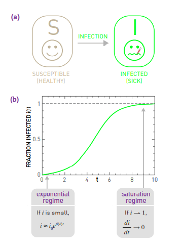
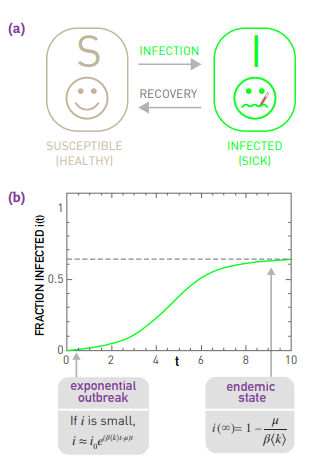
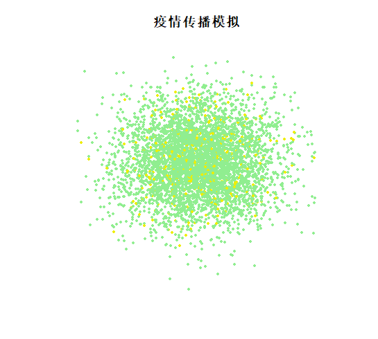

一、概念简介

##传播现象是指丰富丰富多样的流行性现象，在人类社会中，一方以各种媒介方式进行传达和告知，而另一方又通过各种渠道进行了解和认知。

二、模型内容

##在Network Science by Albert中，作者列举了网络传播、病毒传播、地区联系传播等许多复杂的传播现象，并通过SUSCEPTIBLE-INFECTED (SI) 模型和SUSCEPTIBLE-INFECTED-SUSCEPTIBLE (SIS) 模型来具体讨论了非典病毒的传播现象。

（一）SI模型

##假设非典病毒在N个群体中传播，用$$S\left ( t \right )$$来表示当时易感（健康）人数，t和$$I\left ( t \right )$$来表示已经被感染的人数。当t= 0时，每个人都是易感为($$S\left ( 0 \right )= N$$)，没有人被感染为($$I\left ( 0 \right )= 0$$)。假设一个典型个体有<k>接触，并且用$$\beta$$来表示非典将从感染者传播到易感者单位时间内的个体。我们所探讨的问题如下:如果一个人在t= 0时刻(即$$I\left ( 0 \right )= 1$$)被感染，有i人在将在稍后的t时刻被感染。

$$i=\frac{i_0e^{\beta <k>t }}{1-i_0+i_0e^{\beta <k>t}}$$
     

     
（二）SIS模型
     
##大多数病原体最终会被免疫系统治疗。为了遵循人会康复的事实，需要让受感染的人康复，停止疾病传播，即SIS模型。SIS模型与SI模型一样具有易感和已被感染的两种状态。不同的是，现在受感染的个体在固定的时间内恢复速率$$\mu$$，恢复易感状态，此时有i人将在稍后的t时刻被感染。
     
$$i=(1-\frac{\mu }{\beta <k> })\frac{Ce^{(\beta <k>-\mu )t}}{1+Ce^{(\beta <k>-\mu )t}$$
     

     
三、性质
     
（一）实时性
     
##传播现象的实时性体现在流行性的方面。就传播现象而言，它有一个较短的产生、发展、高潮、衰落的过程，绝大多数的传播现象会随着时间的前进而变得逐渐消失在人们的视野当中。
     
（二）影响性
     
##传播现象的影响性体现在影响力大的方面。就像我们每天都会经历的一样，在脸书、推特、新闻报纸等平台所发布的信息会被广为流传，交谈讨论。此过程中，一方面是人们对某种流行所表现的社会心理或思潮的认同，一方面是社会的从众心理的作用。这种双重的作用就使得流行性传播现象具有了十分强大的社会影响力。
     
（三)群体性
     
##传播现象的群体性体现在扩散的程度。如果没有群体的存在，传播本身就不会成立，传播现象也就不复存在。
     
(四）自发性
     
##传播现象的自发性体现在社会群体会以个人意识进行物理或心里上的传播。这是人对传播现象的自然追随和认同，人为的传播是传播现象不可缺少的一环。传播因子的散播就像蜜蜂采蜜一样，是人们的本能。
     
四、举例
     
##通过R语言模拟疫情传播现象来简单探究传播现象的性质：
```{r}
library(tibble)  
library(dplyr) 
plot(x = people$x,
     y = people$y,
     cex = .8,
     pch = 20,
     xlab = NA,
     ylab = NA,
     xlim = c(5, max_plot_x),
     xaxt = "n",
     yaxt = "n",
     bty = "n",
     main = "疫情传播模拟", 
     col = (people %>% left_join(person_color, by = "state") %>%select(color))$color)
```

     
##通过R语言得出的散点图表明，疫情传播现象是逐渐扩散，先快后慢，四处散播。这体现了疫情的传播具有群体性和自发性，并且会逐渐缓慢逐渐消失，即具有实时性。
     
五、总结
     
##传播现象是一个很深奥的现象，传播学是社会学和数字科学等许多学问所融合起来的一门科学。正如书中所述，传播现象的实时预测会成为许多领域非常需要的技术，我们可以通过研究传播现象来总结更多的规律，将传播预测更加深入的运用到各个领域之中。
     
六、参考文献
     
[1].[1]Albert-Laszlo Barabasi.Network Science[M].2014:407-470
     
[2].王德胜. 欲望的机器——当代审美文化批评视野中的大众传播现象[J]. 文史哲, 1998(01):37-43.
